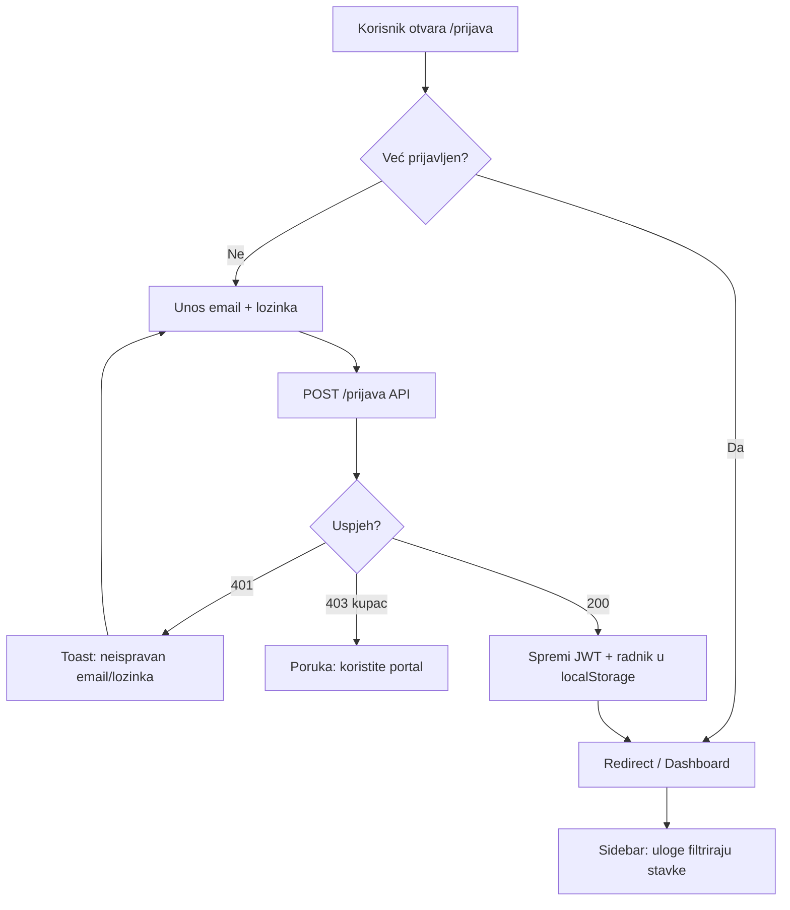
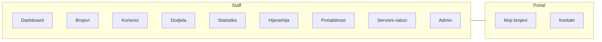

# Korisnički tokovi — HT Eronet

Dijagrami za magistarski rad (KS) i dokumentaciju informacijske arhitekture. Rute odgovaraju `frontend/src/App.tsx`.

**Legenda:** plavi pravokutnik = ekran/ruta; romb = odluka; zaobljeni = vanjski akter.

---

## 1. Prijava — staff aplikacija



**Uloge nakon prijave:**

| Uloga | Vidljivo u izborniku (skraćeno) |
|-------|----------------------------------|
| admin | Sve |
| prodaja | Bez admin-only (import, audit, servisni…) |
| promet | Pregled; bez dodjele |
| kupac | **Ne koristi** `/prijava` |

---

## 2. Dodjela broja (rezervacija → potvrda)

```mermaid
flowchart TD
  S1[/dodjela] --> S2[Učitaj općine + kvalitete]
  S2 --> S3[Korisnik popuni podatke + JMBG]
  S3 --> S4[Debounce: GET provjeri-jmbg]
  S4 --> S5[Rezerviraj sljedeći broj]
  S5 --> S6{Rezervacija OK?}
  S6 -->|Ne| S7[Toast: nema brojeva / greška]
  S6 -->|Da| S8[Prikaži broj + timer 5 min]
  S8 --> S9{Timer istekao?}
  S9 -->|Da| S10[Onemogući dodjelu / nova rezervacija]
  S9 -->|Ne| S11[Klik Dodijeli]
  S11 --> S12{JMBG upozorenje?}
  S12 -->|Da| S13[Modal potvrde]
  S13 --> S14[POST dodijeli-broj]
  S12 -->|Ne| S14
  S14 --> S15{Uspjeh?}
  S15 -->|Da| S16[Success modal + PDF/email]
  S15 -->|Ne| S17[Toast greška]
```

**Ključne točke UX (za evaluaciju):**

- Rezervacija ograničena na **5 minuta** (`useReservationTimer`).
- JMBG validacija + povijest kupca (banner).
- Županijski fallback (backend) — korisnik možda ne vidi eksplicitno u UI.

---

## 3. Korisnici i karantena

```mermaid
flowchart TD
  K1[/korisnici] --> K2[GET /korisnici - grupirano po JMBG]
  K2 --> K3[Filter: svi / zauzet / karantena]
  K3 --> K4[Odabir kartice korisnika]
  K4 --> K5[Prikaz brojeva po statusu]
  K5 --> K6{Akcija}
  K6 -->|Produži karantenu| K7[Modal: dani]
  K7 --> K8[PATCH /msisdn/id/karantena]
  K6 -->|Vrati aktivno| K9[POST vrati-aktivno]
  K6 -->|Oslobodi| K10[Modal: karantena ili slobodan]
  K10 --> K11[POST oslobodi ili admin oslobodi]
  K8 --> K12[Osvježi listu]
  K9 --> K12
  K11 --> K12
```

---

## 4. Dashboard — pregled iskorištenosti

```mermaid
flowchart TD
  D0[/ Dashboard] --> D1[GET /statistike]
  D1 --> D2[Stat kartice + upozorenje >=90%]
  D1 --> D3[GET /admin/statistika/dodjele-heatmap]
  D1 --> D4[GET /opcine/geojson]
  D4 --> D5[Mapa: boja po postotku]
  D1 --> D6[Grafikon po općinama]
  D5 --> D7[Klik općina]
  D7 --> D8[Navigate /brojevi?opcina_naziv=...]
```

**URL filteri na /brojevi** (dijeljivi link, back/forward):

- `opcina_naziv`, `opcina_id` — filter općine (s karte ili izbornika)
- `status` — npr. `karantena`, `zauzet`, `slobodan`
- `page` — stranica rezultata (1 = izostavljeno)
- Ostalo: `korisnik_jmbg`, `lokacija_id`, `uredjaj_id` (iz hijerarhije)

Uzorak: `/brojevi?opcina_naziv=Mostar&status=karantena&page=2`

**Pragovi boja (mapa):**

- &lt; 50 % zeleno  
- 50–90 % narančasto  
- ≥ 90 % crveno  

---

## 5. Portal kupca

```mermaid
flowchart TD
  P0[Vanjski korisnik] --> P1{/portal/prijava}
  P1 --> P2{Ima račun?}
  P2 -->|Ne| P3[/portal/registracija]
  P3 --> P4[POST /kupac/registracija]
  P4 --> P5[POST /kupac/prijava]
  P2 -->|Da| P5
  P5 --> P6{uloga=kupac?}
  P6 -->|Ne| P7[Greška]
  P6 -->|Da| P8[/portal/moji-brojevi]
  P8 --> P9[GET /kupac/moji-brojevi]
  P9 --> P10{Ima brojeva?}
  P10 -->|Da| P11[Preuzmi ugovor PDF]
  P10 -->|Ne| P12[Prazno stanje]
  P8 --> P13[/portal/kontakt]
  P13 --> P14[POST /kupac/kontakt]
```

**Povezanost sa staff:** broj se pojavljuje na portalu tek kad `msisdn.jmbg` odgovara JMBG-u kupca (dodjela u staff app).

---

## 6. Pomoć i demo okruženje

| Ruta | Opis |
|------|------|
| `/pomoc` | Kratki vodič (Dashboard, Dodjela, Karantena, Brojevi, Portal, Uloge) + linkovi |
| Demo banner | Žuti strip u `Layout` ako `import.meta.env.DEV` ili `VITE_DEMO_BANNER=true` |

Pristup: stavka **Pomoć** u sidebaru ili ikona **?** u headeru (sve staff uloge).

---

## 7. Pregled modula po ulogama (IA)



---

## Reference u kodu

| Tok | Glavne datoteke |
|-----|-----------------|
| Prijava staff | `PrijavaPage.tsx`, `AuthContext.tsx`, `routers/auth.py` |
| Dodjela | `DodjelaForma.tsx`, `msisdn_service.dodijeli_broj` |
| Korisnici | `KorisniciPage.tsx`, `KorisnikKartica.tsx`, `catalog_service` |
| Dashboard | `DashboardPage.tsx`, `OpcinaMap.tsx`, `msisdn_service.statistike` |
| Portal | `Portal*.tsx`, `routers/kupac.py` |
| Pomoć / IA | `HelpPage.tsx`, `Breadcrumbs.tsx`, `brojeviUrl.ts` |

Vidi također [backend/docs/HIJERARHIJA_UI.md](../backend/docs/HIJERARHIJA_UI.md) za URL query u hijerarhiji.
